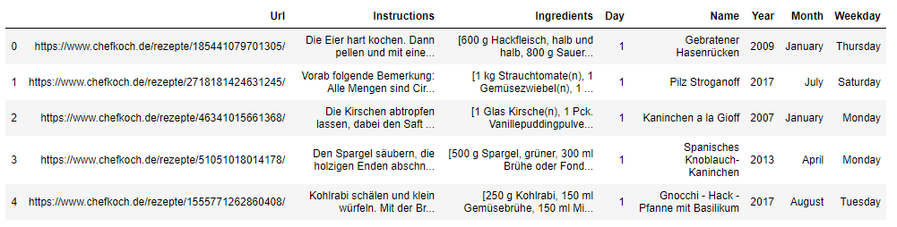
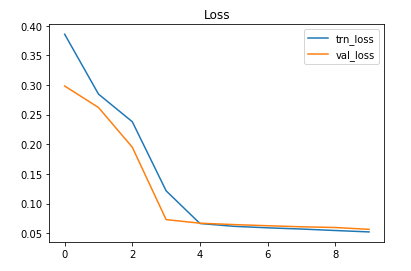

# Introduction 

This project involves building a neural network model to identify ingredients from german recipes dataset. Given the receipe, a nerual network and a named entity recognition model identifies the ingredients from the recipe. 
Open data source with german recipes crawled from chefkoch.de is used for the purpose.  
 
# Project 

Python pandas library is to read the recipes file. Here is a small snippet of the data. 

``` python
data_frames.head()
```
   

```python
data_frames.shape
(12190, 8)
``` 
We see that there are a total of 12190 recipes, and we split it into train test to build and test the model. 
Recipes from 1 to 11.000 are used to train our model and remaining 1190 are used to test the model. 
We see that our data has Ingredients and instruction column. 

```python
data_frames.ingredients[4] 
``` 
['250 g Kohlrabi',
 '150 ml Gemüsebrühe',
 '150 ml Milch',
 '250 g Farfalle oder Kelche',
 '100 g Kochschinken',
 '100 g Frischkäse ( evtl. mit Kräutern )',
 'Salz und Pfeffer',
 'einige Stiele Petersilie',
 'evtl. Saucenbinder, hell']
 
 ``` python
 data_frames.Instructions[4]
``` 
'Kohlrabi schälen und klein würfeln. Mit der Brühe und der Milch aufkochen lassen und zugedeckt kochen, bis er gar, aber noch bissfest ist.Währenddessen die Nudeln in reichlich Salzwasser bissfest kochen.Den Kochschinken in kurze Streifen schneiden. Petersilie waschen, trocken tupfen und fein hacken. Alles mit dem Frischkäse unter die Kohlrabi rühren. Die Sauce mit Salz und Pfeffer abschmecken, bei Bedarf mit hellem Saucenbinder binden.Die Sauce mit den Nudeln anrichten.Dazu schmeckt ein grüner Salat.'

We first consider all the words in the Ingredients column to create a named entity model for our ingredients. 
spaCy https://spacy.io/ an open-source software library for advanced natural language processing is used for the purpose. 

``` python
!python -m spacy download de_core_news_sm

import spacy
nlp = spacy.load('de_core_news_sm', disable=['parser', 'tagger', 'ner'])
```

We first clean the ingredients column of any stop words and then tokenise each unique word found in the ingredients column to form our required named-entities. 
``` python
set([t.text for t, l in zip(tokenized[4], labels[4]) if l])
``` 
For example, from recipe number 4, we find these tokens for our named entity model. 
{'Frischkäse',
 'Kochschinken',
 'Kohlrabi',
 'Milch',
 'Petersilie',
 'Pfeffer',
 'Salz',
 'Saucenbinder'}

Next step is to prepare a token sequence, a word2vec model to convert our data to vector format for the neural network. 
We use a custom maximum lenth of 400 to pad the data(for equal length) and vocabulary based on our dataset. 

```python 
embedd[4]
array([192, 193, 194, 183, 195, 196, 128, 197,   9, 198, 199, 200, 201,
       202, 203,  60, 204, 205,   9,  13, 206,  15,  23,  98, 207, 208,
        51, 209,  68, 202, 203,  25,   6, 195, 125, 202, 210, 211, 212,
        33,  45, 213, 214, 100, 196,  13, 215, 216, 217,  33,   9,  68,
       218, 219, 213, 169,  35,  82, 100, 220, 221, 202,   6, 222,  45,
       223,  48, 224,  33,  67, 225, 100, 226,   6, 227, 228, 229, 130,
        45,  92,  85, 230, 211, 231,   6, 232, 233, 234, 235, 145, 157,
       236,   9, 237, 238, 104, 239, 210, 240, 157, 241,  54,   6, 109,
       242, 243, 244, 245, 246, 187, 247,   6, 248, 183, 249, 250,  33,
       129,  13, 251, 252, 101, 253,  33, 254,   9,  31, 255,  40, 172,
         6,   2, 256, 257, 177, 258, 259, 260,  33,  42, 261, 262, 263,
       131, 264, 265, 266,  33, 267,  74, 268, 269,  68, 270,   6,   0,
         0,   0,   0,   0,   0,   0,   0,   0,   0,   0,   0,   0,   0,
         0,   0,   0,   0,   0,   0,   0,   0,   0,   0,   0,   0,   0,
         0,   0,   0,   0,   0,   0,   0,   0,   0,   0,   0,   0,   0,
         0,   0,   0,   0,   0,   0,   0,   0,   0,   0,   0,   0,   0,
         0,   0,   0,   0,   0,   0,   0,   0,   0,   0,   0,   0,   0,
         0,   0,   0,   0,   0,   0,   0,   0,   0,   0,   0,   0,   0,
         0,   0,   0,   0,   0,   0,   0,   0,   0,   0,   0,   0,   0,
         0,   0,   0,   0,   0,   0,   0,   0,   0,   0,   0,   0,   0,
         0,   0,   0,   0,   0,   0,   0,   0,   0,   0,   0,   0,   0,
         0,   0,   0,   0,   0,   0,   0,   0,   0,   0,   0,   0,   0,
         0,   0,   0,   0,   0,   0,   0,   0,   0,   0,   0,   0,   0,
         0,   0,   0,   0,   0,   0,   0,   0,   0,   0,   0,   0,   0,
         0,   0,   0,   0,   0,   0,   0,   0,   0,   0,   0,   0,   0,
         0,   0,   0,   0,   0,   0,   0,   0,   0,   0,   0,   0,   0,
         0,   0,   0,   0,   0,   0,   0,   0,   0,   0,   0,   0,   0,
         0,   0,   0,   0,   0,   0,   0,   0,   0,   0,   0,   0,   0,
         0,   0,   0,   0,   0,   0,   0,   0,   0,   0,   0,   0,   0,
         0,   0,   0,   0,   0,   0,   0,   0,   0,   0,   0,   0,   0,
         0,   0,   0,   0,   0,   0,   0,   0,   0,   0])
 ```
 
 Now we build the model 
```python 
from keras.models import Sequential
from keras.layers import Dense
from keras.layers import LSTM
from keras.layers.embeddings import Embedding

''' Model '''
model = Sequential()
model.add(Embedding(input_dim=len(vocab), mask_zero=True, output_dim=50)
model.add(SpatialDropout1D(0.2)
model.add(Bidirectional(layers.LSTM(units=64, return_sequences=True))
model.add(SpatialDropout1D(0.2)
model.add(Bidirectional(layers.LSTM(units=64, return_sequences=True))
model.add(Dense(1, activation='sigmoid')

model.compile(loss='binary_crossentropy', optimizer='adam', metrics=['accuracy'])
```

We see the summary of the model built 
```python 
Model: "sequential"
_________________________________________________________________
Layer (type)                 Output Shape              Param #   
=================================================================
embedding (Embedding)        (None, None, 50)          881600    
_________________________________________________________________
spatial_dropout1d (SpatialDr (None, None, 50)          0         
_________________________________________________________________
bidirectional (Bidirectional (None, None, 128)         58880     
_________________________________________________________________
spatial_dropout1d_1 (Spatial (None, None, 128)         0         
_________________________________________________________________
bidirectional_1 (Bidirection (None, None, 128)         98816     
_________________________________________________________________
dense_1 (TimeDistri (None, None, 1)           129       
=================================================================
Total params: 1,039,425
Trainable params: 1,039,425
Non-trainable params: 0
_________________________________________________________________
```
Now we fit the data on our model, and run for 10 epochs(this can be increased) 

```python
history = model.fit(X_seq, y_seq, epochs=1, batch_size=256, validation_split=0.1)
```
We plot the loss for each epoch for our model. 
```python 
plt.plot(history.history["loss"], label="trn_loss");
plt.plot(history.history["val_loss"], label="val_loss");
plt.legend();
plt.title("Loss");
```



We achieve around 95% accuracy for our model on training data. 
Now time to test how well it is performing on our test dataset. 

```python
history = model.fit(X_seq, y_seq_new, epochs=1, batch_size=256, validation_split=0.1)
```
Now we consider a random example from the recipe database to see how well our ingredients have been identified. 

```python 
i = 26
pred_i = y_pred_test[i] > 0.05
print(eval_tokenized[i])
print()
print(eval_ingredients[i])
print()
ingreds = [t.text for t, p in zip(eval_tokenized[i], pred_i) if p]
print(set(ingreds))
```
The following is our recipe 
" Kohlrabi schälen und klein würfeln. Mit der Brühe und der Milch aufkochen lassen und zugedeckt kochen, bis er gar, aber noch bissfest ist.Währenddessen die Nudeln in reichlich Salzwasser bissfest kochen.Den Kochschinken in kurze Streifen schneiden. Petersilie waschen, trocken tupfen und fein hacken. Alles mit dem Frischkäse unter die Kohlrabi rühren. Die Sauce mit Salz und Pfeffer abschmecken, bei Bedarf mit hellem Saucenbinder binden.Die Sauce mit den Nudeln anrichten.Dazu schmeckt ein grüner Salat."

Following is the Ingredients provided 
['250 g Kohlrabi',
 '150 ml Gemüsebrühe',
 '150 ml Milch',
 '250 g Farfalle oder Kelche',
 '100 g Kochschinken',
 '100 g Frischkäse ( evtl. mit Kräutern )',
 'Salz und Pfeffer',
 'einige Stiele Petersilie',
 'evtl. Saucenbinder, hell']

Following are the ingredients identified by our model 
Kohlrabi, schälen, Brühe, Milch, Kochschinken, Petersilie, Frischkäse, Salz, Pfeffer, Saucenbinder, Salat

Our model is able to identify the ingredients quite well.  
